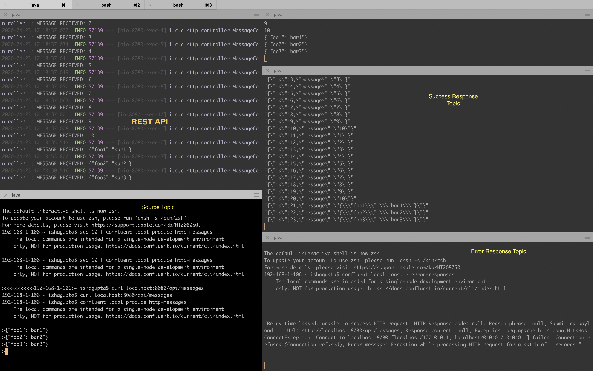
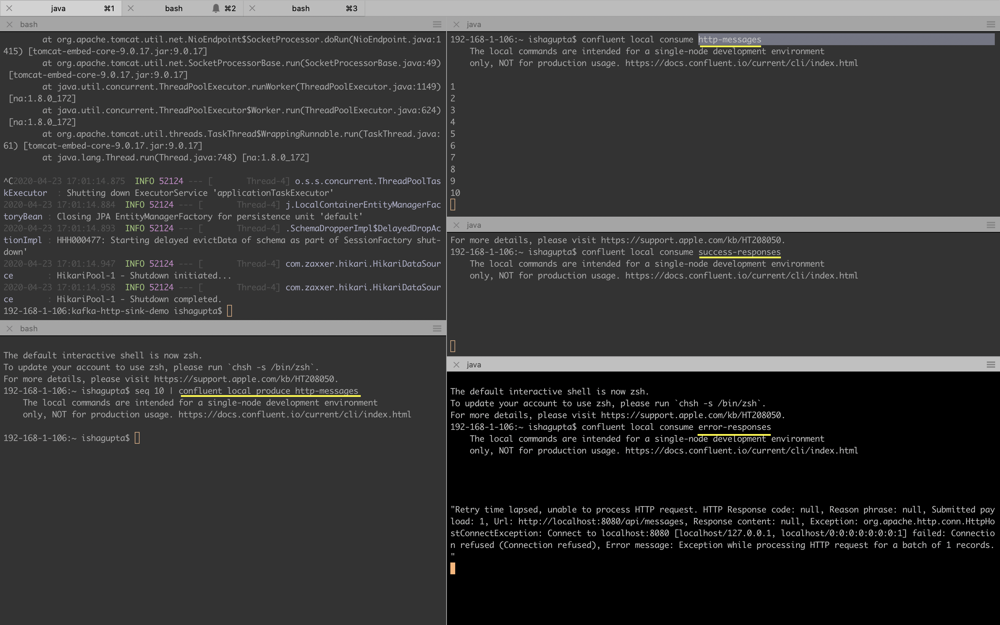

# How to use Kafka Http Sink Connector from Confluent

### Problem statement:
- How to move data *from* KAFKA cluster *to* a REST API.
- Capture the API response.
- Capture any API errors while posting the message.
- Transform the messages

Confluent has recently released a [HTTP-Sink-Connector](https://docs.confluent.io/current/connect/kafka-connect-http/index.html#connect-http-connector). In this demo I am demonstrating how this connector can be used to solve the above mentioned problems.

Note: This connector needs a license for production use.

### Prerequisites:

Confluent Platform is installed and services are running locally.

### How to install and run a local kafka cluster

Note: Download the Confluent platform tar or zip and extract it into a directory `~/confluent-platform`. Set an environment variable to this path.

```
export CONFLUENT_HOME=~/confluent-platform
export PATH=$PATH:$CONFLUENT_HOME/bin
```
Install confluent hub client using brew. Commands for MacOS

```
brew tap confluentinc/homebrew-confluent-hub-client
brew cask install confluent-hub-client
```

### Install http connector using confluent hub client.

```
confluent-hub install confluentinc/kafka-connect-http:latest
```

## Demo REST API service

Start any REST API for testing.
*I used the one used by Confluent `kafka-connect-http-demo`*

```
git clone https://github.com/confluentinc/kafka-connect-http-demo.git
cd kafka-connect-http-demo
mvn spring-boot:run -Dspring.profiles.active=simple-auth
```

### Start the local kafka cluster

```
confluent local start
```

### Load the simple Http sink connector

```
confluent local load httpsink -- -d simpleHttpSink.json
```

[Configuration details about the connector](https://docs.confluent.io/current/connect/kafka-connect-http/connector_config.html#connection)

### Check status of connector

```
confluent local status SimpleHttpSink
```
For the sake of demo, let's monitor 3 topics:
- `http-messages`
- `success-responses`
- `error-responses`

#### Capturing the HTTP Response from the API

Produce some string messages to the Source `http-messages` topic
```
confluent local produce http-messages
```

Consume the http response in the `success-responses` topic

Note: Open few consumers in another terminal window to monitor the other topics.

```
confluent local consume <topic-name>
```



#### Capturing Failed POST requests:

We can do error reporting to produce records to after each unsuccessful POST.

*Note: There is a lag in error reporting because of the retry attempts. Retry attempts are configurable.*

Reproduce a error in the REST API, error is received in the `error-responses` topic.
*(See in the bottom right corner in the screenshot)*



#### Transformation of messages

[SMT](https://www.confluent.io/blog/kafka-connect-single-message-transformation-tutorial-with-examples/)(Single Message Transform) can be used to transform the message for the http request body. There are many pre-build transformations available.
We can also write custom Transformations.

Aggregation, being a stateful transformation, cannot be done within SMTs.
Complex transformations and operations that apply to multiple messages are best implemented with KSQL and Kafka Streams.

### Troubleshooting:

- Below are some commands to debug some issues:

```
//Restart the connector
curl -X POST localhost:8083/connectors/SimpleHttpSink/restart | jq

//Unload a connector
confluent local unload SimpleHttpSink -- -d simpleHttpSink.json

```
- You can also delete the connector and create it again. Refer the below links.

### References for futher reading:

- [HTTP-Sink-Connector](https://docs.confluent.io/current/connect/kafka-connect-http/index.html#connect-http-connector)
- [Confluent Quickstart](https://docs.confluent.io/current/quickstart/index.html)
- [Confluent Local](https://docs.confluent.io/current/cli/command-reference/confluent-local/index.html#confluent-local)
- [Managing Kafka Connect](https://docs.confluent.io/3.2.0/connect/managing.html)
- [Confluent blog](https://www.confluent.io/blog/webify-event-streams-using-kafka-connect-http-sink/)

