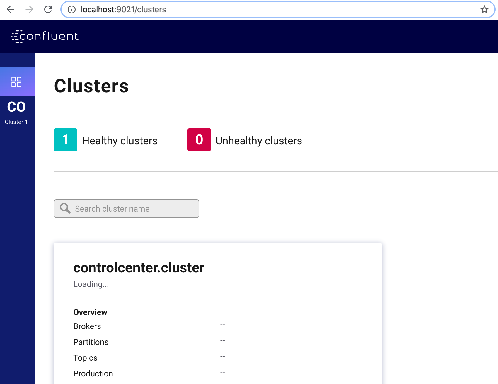

# Using Docker to start a local kafka cluster

I used the docker quickstart to run a local kafka cluster with a http connector already running in it, follow the below step to do so. 

From the project directory, run the following docker command:

```
docker-compose up -d
```
Wait for a kafka cluster and connector to become healthy. You should see something like this when you do 

```
>docker-compose ps


     Name                  Command               State                         Ports                   
-------------------------------------------------------------------------------------------------------
broker            /etc/confluent/docker/run   Up             0.0.0.0:9092->9092/tcp                    
control-center    /etc/confluent/docker/run   Up             0.0.0.0:9021->9021/tcp                    
http-connector    /etc/confluent/docker/run   Up (healthy)   0.0.0.0:8083->8083/tcp, 9092/tcp          
schema-registry   /etc/confluent/docker/run   Up             0.0.0.0:8081->8081/tcp                    
zookeeper         /etc/confluent/docker/run   Up             0.0.0.0:2181->2181/tcp, 2888/tcp, 3888/tcp
```

I am using curl command to interact with the cluster using the kafka connect container in the following way:

//Get worker cluster ID, version, and git source code commit ID:
```
curl localhost:8083/ | jq
```

List all the connectors available on a kafka-connect worker:
```
curl localhost:8083/connector-plugins | jq
```

List active connectors
```
curl localhost:8083/connectors | jq
```
At the moment, we dont have any connectors.

Load the simple http connector with the configuration in `simpleHttpSink.json`

```
curl -X POST -H "Content-Type: application/json" --data @simpleHttpSink.json http://localhost:8083/connectors
```
Now list active connectors
```
curl localhost:8083/connectors | jq

[
  "SimpleHttpSink"
]
```

Get the configuration of the connector:

```
curl localhost:8083/connectors/SimpleHttpSink | jq
```
Output should resemble:
```
{
  "name": "SimpleHttpSink",
  "config": {
    "connector.class": "io.confluent.connect.http.HttpSinkConnector",
    "confluent.topic.bootstrap.servers": "localhost:9092",
    "topics": "http-messages",
    "tasks.max": "1",
    "http.api.url": "http://localhost:8080/api/messages",
    "reporter.bootstrap.servers": "localhost:9092",
    "reporter.error.topic.name": "error-responses",
    "reporter.result.topic.name": "success-responses",
    "reporter.error.topic.replication.factor": "1",
    "confluent.topic.replication.factor": "1",
    "name": "SimpleHttpSink",
    "value.converter": "org.apache.kafka.connect.storage.StringConverter",
    "reporter.result.topic.replication.factor": "1"
  },
  "tasks": [],
  "type": "sink"
}
```
Command to check the status of the connector

```
curl localhost:8083/connectors/SimpleHttpSink/status | jq
```

You can also visit the control center running to `localhost:9021` to see the status of the cluster.


